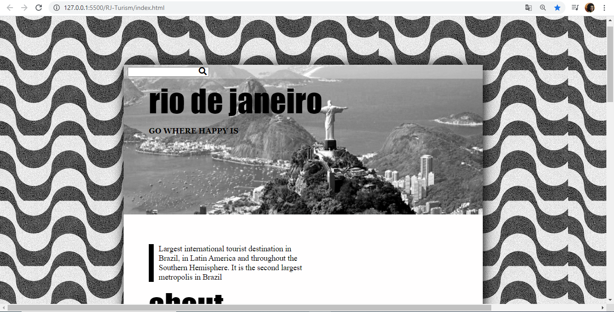

# CSS - HTML Layouts

The projects use CSS and HTML resources.

* Rio de Janeiro - One Page Layout

## RUN
 Copy the path of the .html of the project you want
 and paste at your browser 

## Meta

Tárcila Fernanda Resende da Silva – [@tarcila414] – tarcila086@gmail.com

## Contributing
1. _Fork_ it (<https://github.com/tarcila414/css-html/fork>)
2. Create your feature _branch_ (`git checkout -b feature/fooBar`)
3. _Commit_ your changes (`git commit -am 'Add some fooBar'`)
4. _Push_ to the branch (`git push origin feature/fooBar`)
5. Create a new _Pull Request_

